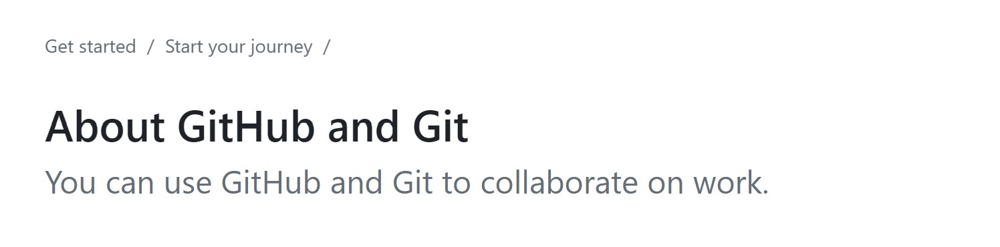
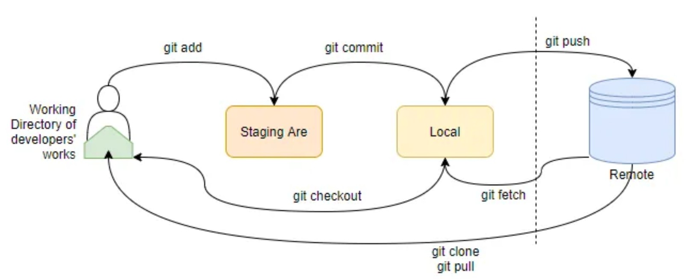

### Why You Should Manage Versions

When writing code or command-line scripts, I often encounter situations like this:

> A script works perfectly 90% of the time, but one line causes problems or could be optimized. After modifying it, the entire script breaks, and I’ve completely forgotten what I changed. The ‘script_90%work’ version is lost, and I have to start over relying on fragmented memory
> 

Sometimes I copy a script to modify it, but without careful naming, my project folder ends up full of scripts like `I_did_this_1.0` and `I_did_this_2.0`. In the end, I have no idea what the differences between them are.

As a wet-lab researcher, I am used to saving many raw images in folders, because by cross-referencing file dates with my lab notebook, I can track what each folder contains. Code is different: if you cannot meticulously log each command and its output, **regularly storing different versions of scripts and results is crucial.**

In my exploration, I found that **Git is a very powerful tool**:

By combining Git with GitHub and developing a habit of committing frequently, you essentially create a digital lab notebook. You can easily track historical versions of your scripts, saving a lot of time, effort, and mental overhead.

💡 **Version control in Git works in three main steps:**

  1. `git add <file>` — add files to the staging area; these are the files that will be included in the next commit
  2. `git commit -m "message"` — packages all staged files into a snapshot and saves it in `.git`
  3. `git push origin main` — pushes commits from the local branch to the corresponding branch on the remote repository

### Learning Resources

- Official GitHub help documentation👇

  [https://docs.github.com/en/get-started/start-your-journey/about-github-and-git](https://docs.github.com/en/get-started/start-your-journey/about-github-and-git)

{fig-align="center" width="500"}

- An introduction to Git on a Chinese blog👇

  [https://www.ruanyifeng.com/blog/2018/10/git-internals.html](https://www.ruanyifeng.com/blog/2018/10/git-internals.html)


### Basic Workflow for Pushing Local Code to GitHub

1. Log in to GitHub and create a repository. Adding a `README` or `.gitignore` is optional (you can also create them locally and push later).
2. Initialize Git in your local project folder. If you are using linux system:
  ```r
  # 0. Create local project directory
  mkdir Sequence_Processing_Tool_Project
  cd Sequence_Processing_Tool_Project
  ```
3. Use Git to manage files and push them to the remote repository.

{fig-align="center" width="500"}


### Common Git Commands

```r
# 1. Initialize a Git repository
git init  # Make sure you are in the correct project folder
# If you are in the wrong folder, remove the repository
rm -rf .git

# 2. Add files to the staging area
git add .  # Track the entire folder, or specific files: git add <file_name>

# 3. Commit changes locally
git commit -m "Initial commit: add sequence processing tool and scripts"

# 4. Link to a remote repository
git remote add origin https://github.com/yaqi-jiao/SeqProcessingTool.git
git remote -v  # Verify the remote repository

# Expected output
# origin  git@github.com:yaqi-jiao/Sequence_Processing_Tool_Project.git (fetch)
# origin  git@github.com:yaqi-jiao/Sequence_Processing_Tool_Project.git (push)

# 5. Set main branch and push
git branch -M main
git push -u origin main

# 6. Check status and manage staging
git status  # View staged files
git reset   # Unstage all files
git restore --staged data/ result/  # Remove unwanted files from staging
git restore --staged data/sample.txt
```

### Branch Management

By default, GitHub uses the `main` branch.

```r
# Create a new branch
git checkout -b feature_x

# Make changes in this branch, then push with:
git push -u origin feature_x
```

### Cloning a Repository from GitHub

If your local repository and GitHub are out of sync, first pull the remote repository, merge changes, then push.
Conflicts may occur if local and remote files differ. Files with conflicts will appear highlighted; edit them manually, then `add` and `commit` before pushing.

```r
git pull origin main --allow-unrelated-histories
```

### Tips for Using Git Effectively

- Start with a well-organized local project folder.
- Avoid deleting files directly on GitHub. Delete locally and sync with Git.
- Write a `README` file for each repository.
- To back up R scripts, create an **RProject** and select `create a git repository`. You can then commit files from RStudio, but pushing still requires the terminal.
- Git works equally well on Linux and servers for code management.
