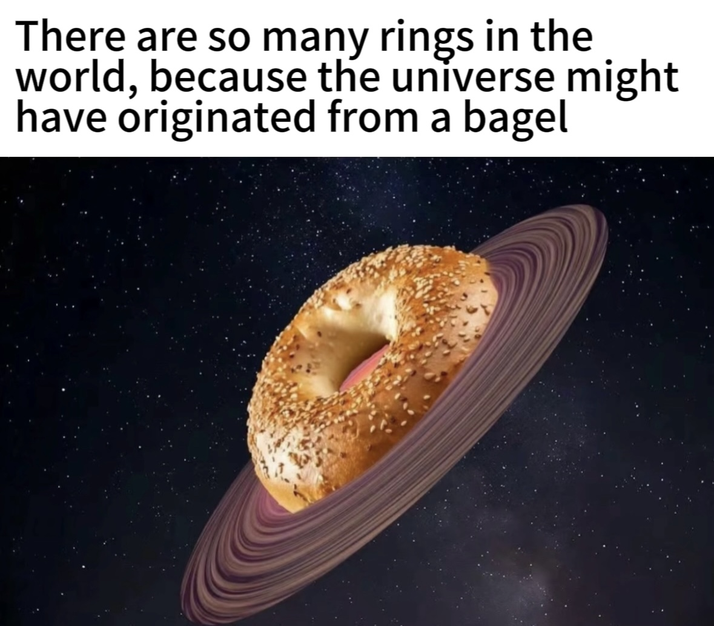

The best time to start a tech blog was ten years ago. The second-best time is now.

About three years ago, I was introduced to bioinformatics. My supervisor suggested I research a evolutionary conserved genomic sequence. As the first person in a traditional wet-lab to venture into genomics, I had to learn Linux, R, and how to use bioinformatics databases from scratch---all while conducting experiments. It wasn't a smooth journey. Even with the wealth of learning resources available online, the problems I encountered weren't always standard enough to find quick solutions. So, I started documenting my failures and notes in detail, a habit that gradually took root.

Last year, I had the opportunity to study bioinformatics more systematically. With more to learn, I also had more to document. Those notes and lines of code lay quietly in my memos or Notion databases, waiting for me to retrieve them when needed. But I never made them public. At first, I thought the problems that puzzled me were too rookie, too trivial---issues no one else would care about. Later, with the rise of LLMs like ChatGPT and DeepSeek, it seemed even less necessary: you could just type a precise question into a dialog box and get a highly tailored answer within seconds. Did writing a technical blog still matter? Could my content still be helpful to others? The thought, "I'm not skilled enough to produce meaningful content," lingered like a shadow hovering over me, one I couldn't shake off.

Then, one day early in 2026, it suddenly hit me: "I think I'm ready." All the self-doubt vanished. It wasn't that I woke up feeling overwhelmingly confident, but rather, I felt a natural sense of calling. I knew that organizing, writing, and sharing these insights would make me more complete. And I believe I'm not alone---there must be others, perhaps those standing at the crossroads of wet and dry labs, feeling lost. They might need this.

{fig-align="center" width="500"}
